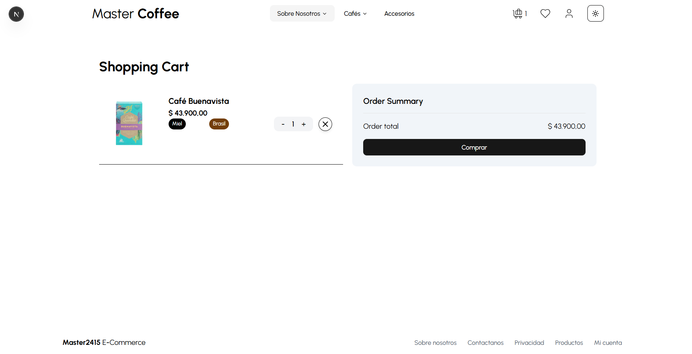
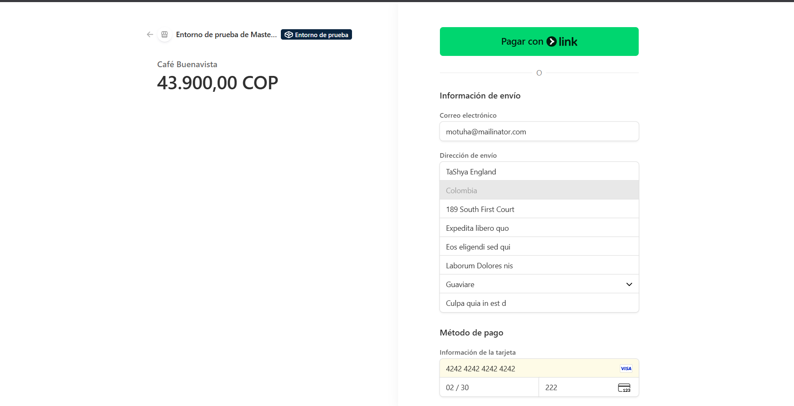
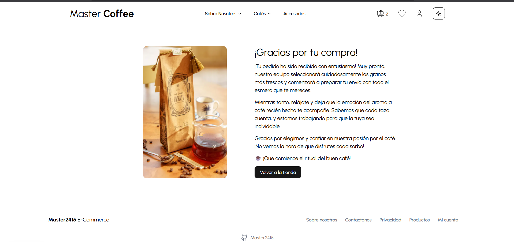

# 🛍️ Frontend Ecommerce

Bienvenido al repositorio del **Frontend Ecommerce**. Este proyecto es una aplicación web moderna y robusta diseñada para ofrecer una experiencia de compra fluida y atractiva. Construida con las últimas tecnologías del ecosistema React, esta tienda en línea destaca por su diseño premium, rendimiento optimizado y funcionalidades completas de comercio electrónico.

## 🚀 Funcionamiento

La aplicación permite a los usuarios navegar por un catálogo de productos, filtrar por categorías y ver detalles específicos de cada artículo. Los usuarios pueden agregar productos a su carrito de compras, gestionar las cantidades y proceder al pago de manera segura.

### Características Principales:
- **Catálogo Dinámico**: Exploración de productos con carga rápida y eficiente.
- **Carrito de Compras**: Gestión de estado global con **Zustand** para una experiencia de usuario instantánea.
- **Pasarela de Pagos**: Integración con **Stripe** para procesar pagos de manera segura.
- **Diseño Responsivo**: Interfaz adaptada a dispositivos móviles y de escritorio.
- **Modo Oscuro/Claro**: Soporte nativo para temas visuales.
- **Notificaciones**: Sistema de alertas y notificaciones con **Sonner**.

## 🛠️ Tecnologías Utilizadas

Este proyecto utiliza un stack tecnológico de vanguardia para asegurar escalabilidad, mantenibilidad y rendimiento:

- **[Next.js 15](https://nextjs.org/)**: Framework de React para producción, utilizando App Router.
- **[React 19](https://react.dev/)**: Biblioteca para construir interfaces de usuario.
- **[Tailwind CSS 4](https://tailwindcss.com/)**: Framework de utilidad para estilos rápidos y modernos.
- **[Shadcn UI](https://ui.shadcn.com/)**: Colección de componentes reutilizables y accesibles (basados en Radix UI).
- **[Zustand](https://zustand-demo.pmnd.rs/)**: Gestor de estado ligero y potente para el carrito de compras.
- **[Stripe](https://stripe.com/)**: Infraestructura de pagos para internet.
- **[Axios](https://axios-http.com/)**: Cliente HTTP para la comunicación con el backend.
- **[Lucide React](https://lucide.dev/)**: Iconografía hermosa y consistente.
- **[Next Themes](https://github.com/pacocoursey/next-themes)**: Gestión de temas (Dark/Light mode).

---

## 📸 Galería y Demostración

A continuación se muestra el diseño y funcionamiento de la aplicación.

### 🖼️ Capturas de Pantalla

#### 1. Experiencia de Usuario
| Página Principal | Sección de Descuentos |
|:---:|:---:|
|  |  |

#### 2. Flujo de Compra
| Añadir Producto | Compra de Producto |
|:---:|:---:|
|  |  |

#### 3. Finalización
| Compra Exitosa | Pie de Página |
|:---:|:---:|
|  |  |

---

### 🎥 Videos Demostrativos

> **Nota:** GitHub no permite la reproducción directa de videos locales en el README. Por favor, haz clic en los enlaces para verlos o descargarlos.

- **🎬 [Ver Video: Diseño Principal](Images/Diseño%20principal.mkv)**  
  *Un recorrido por la interfaz de usuario, destacando la estética moderna y la navegación fluida.*

- **🛒 [Ver Video: Proceso de Compra](Images/Compra%20de%20un%20producto.mkv)**  
  *Demostración del flujo completo de compra, desde la selección del producto hasta el checkout.*

---

## 👤 Autor

**Douglas T.**

- GitHub: [@Master2415](https://github.com/Master2415)
